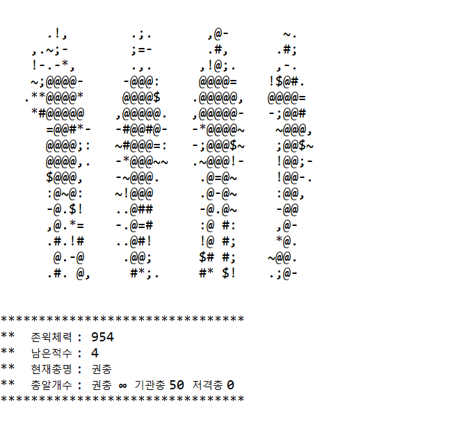

# johnwick_game

### use eclipse
    소스를 받기전 eclipse tool을 확인해주세요
	https://www.eclipse.org/downloads/

###	조작방법
    기본적 설명은 게임시작후 확인해주세요
    조작키 q
    총바꾸기 f
    움직이기 w, s, a, d 이며
    해당 문자를 입력후 엔터를 눌러야 합니다.

### 게임설명
    영화 존윅을 모티브로 stage 형태의 게임이 진행이 됩니다.
    기본적으로 console 창에서 진행이 되는 게임입니다.
    소리가 나오니 스피커를 켜주세요.

###	게임 시작
	github 소스를 clone 하시고 eclipse 에 프로젝트 추가합니다.
    Run 파일은 src -> Main -> Action.java 입니다.

### 게임 화면
    스토리 화면

    전투 화면

    테마게임 화면

    미션 화면

    게임 화면

